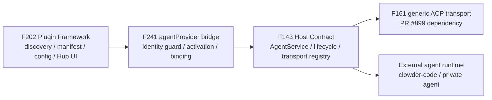

# F241: Agent Provider Plugin / Hostable Provider Runtime

> **Status**: accepted feature anchor | **Owner**: Community (彭潇 / `bouillipx`) + Cat Cafe maintainer guard | **Priority**: P1
> **Source**: operator request 2026-06-18 — "我有自己的 agent 需要接入进来"; community architecture discussion [clowder-ai#941](https://github.com/zts212653/clowder-ai/issues/941); maintainer decision [#941 comment 4739146327](https://github.com/zts212653/clowder-ai/issues/941#issuecomment-4739146327).
> **Decision**: accepted as **F241: Agent Provider Plugin / Hostable Provider Runtime**. This is a new provider-extension feature anchor, **not** "F202 Phase 3" by default, and **not** a rename of F143. It is the F143 host-contract lineage plus the F202 plugin discovery/config surface, composed into a provider-as-plugin product capability.

Architecture cell: `provider-extension` (new) — sits above F143 `hostable-runtime` and F202 `plugin`, composing both.

Map delta: added — `provider-extension` owns how an externally declared agent provider becomes a routeable, @-mentionable cat without editing the hardcoded `ClientId` union or the `packages/api/src/index.ts` provider switch. It consumes host-owned transports from F143/F161 and extends F202 with an `agentProvider` manifest resource.

## Why

Cat Cafe can already host several built-in agent providers, but adding a new external agent runtime still requires core edits:

1. edit `packages/shared/src/types/cat.ts` to add a `ClientId`;
2. edit `packages/api/src/index.ts` provider construction;
3. add bespoke provider service / event transform code;
4. update Hub provider UI;
5. merge a core PR for every new runtime.

That is not a plugin path. It blocks the operator's immediate requirement: a private/custom agent runtime should be connectable to Cat Cafe without vendoring it into this repository and without making every provider a one-off core patch.

The target shape is:

- Cat Cafe owns the northbound contract, routing, identity, callback/MCP injection, cwd/sandbox, audit, cancel, timeout, and UI/config boundary.
- External agent runtimes are installed and managed outside Cat Cafe core.
- A plugin/provider package declares metadata and a constrained transport binding.
- Cat Cafe activates that declaration into a routeable cat only through host-owned transport implementations.

## Current source anchors

| Fact | Anchor | Consequence |
|---|---|---|
| Provider identity is still a fixed `ClientId` union | `packages/shared/src/types/cat.ts` | New provider identity still implies core type churn. |
| Provider construction still lives in API startup wiring | `packages/api/src/index.ts` | New provider transport still tends to become a core branch. |
| F202 owns plugin discovery/config/resource activation | `docs/features/F202-plugin-framework.md` | `agentProvider` belongs as a new resource family, not as an ad hoc config file. |
| F143 owns the hostable runtime contract concept | `docs/features/F143-hostable-agent-runtime.md` | F241 must consume/advance this host contract, not fork a parallel registry. |
| F161 / PR #899 generalizes ACP | `docs/features/F161-acp-carrier-generalization.md`, PR #899 | F241 should consume generic ACP once merged; do not rebuild it. |
| F240 / PR #903 validates manifest/config/Hub patterns | PR #903 | F241 can reuse the manifest/config/UI precedent after merge, but routeable agents are a higher trust tier than IM connectors. |
| F211 runtime-session enum is still narrow | `docs/features/F211-cross-runtime-session-transparency.md` | New provider runtimes need session/audit visibility, not hidden sidecars. |

## Ownership boundary

F241 owns the bridge between plugin declaration and routeable agent identity:



| Layer | Owns | F241 must not re-own |
|---|---|---|
| F202 | plugin discovery, manifest parsing, config store, Hub rendering, resource activation mechanics | host transport semantics |
| F143 | hostable runtime contract, lifecycle, host-owned transport registry | plugin discovery / manifest ecosystem |
| F161 | generic ACP carrier implementation and env/session/pool details | provider-as-plugin identity and activation |
| F240 | manifest/config-store/Hub UI precedent for IM connectors | routeable agent trust boundary |
| F241 | `agentProvider` resource, provider identity governance, plugin-to-host binding, routeable cat activation | arbitrary provider code execution |

## Proposed manifest shape

Initial sketch:

```yaml
id: clowder-code
resources:
  - type: agentProvider
    providerId: clowder-code
    displayName: Clowder Code
    transport: acp
    command: clowder-code
    startupArgs: ["--acp"]
    accountRef: optional-account-binding
    eventProfile: cat-cafe-agent-message-v1
    mcpWhitelist:
      - cat-cafe-collab
      - cat-cafe-memory
    sandbox: workspace-write
    healthCheck:
      type: acpInitialize
```

Important constraints:

- `transport` must reference a host-owned allowlisted transport.
- `command` is an already-installed command in Phase A; no plugin installer scripts.
- callback/MCP credentials are injected only by host code.
- provider identity must pass namespace and routeability checks before becoming a cat.

## Accepted Phase Split

### Phase A — Host Transport Intake Slice

Goal: prove one host-owned transport path and one external runtime end to end without adding a new bespoke provider branch.

Inputs:

- F161 / PR #899 if merged: consume the generic ACP carrier instead of rebuilding Gemini ACP generalization.
- If ACP is not ready for the operator's private agent, allow a constrained A2A or CLI JSONL smoke path to validate identity/routing/audit first.

Acceptance criteria:

- One host-owned transport path is registered and selected by data/config.
- One external runtime can be invoked as an already-installed command or service.
- Streaming output maps to `AgentMessage` / thread-visible events.
- cancel, timeout, startup failure, and no-event failure paths are visible.
- cwd/workspace/sandbox policy is host-controlled.
- callback/MCP injection is host-owned and test-covered.
- session-chain/audit metadata is written for the external runtime.

### Phase B — F202 `agentProvider` Resource

Goal: make provider activation declarative through the plugin framework.

Acceptance criteria:

- F202 manifest schema accepts `agentProvider` with strict validation.
- Invalid transports, duplicate provider IDs, builtin namespace collisions, and forbidden capability claims are rejected.
- Hub can render provider config from manifest/config-field metadata without provider-specific UI.
- Config values resolve through a host-owned config store; plugin code does not receive secrets directly.
- Health checks are host-owned and declared/configured, not arbitrary script execution.

### Phase C — Reference Runtime

Goal: use `clowder-code` as the reference runtime for proving the extension point without vendoring it into Cat Cafe core.

Acceptance criteria:

- A routeable cat invokes the external runtime from a normal thread.
- The runtime can stream a reply back into the thread.
- session chain, audit, cancel, timeout, and failure states are inspectable.
- A2A handoff and @ mention routing cannot target the provider until identity governance has approved it.
- E2E proof includes at least one denied capability / denied namespace case.

## Identity and Routeability Governance

This is not just a sandbox problem. A provider plugin can create a routeable participant in the collaboration system.

Required controls:

- provider IDs live in a reserved namespace, separate from built-in `ClientId`s unless explicitly migrated;
- plugins cannot claim `anthropic`, `openai`, `google`, `kimi`, `opencode`, `catagent`, `a2a`, or any existing runtime cat ID;
- routeable `catId` and `@alias` activation requires explicit host approval;
- provider identity, plugin source, transport, command, and capability grants are audit-visible;
- a provider cannot become an A2A target until activation and health checks pass.

## Safety Boundaries

These are acceptance boundaries, not implementation details:

- no arbitrary same-power JS factory;
- no plugin-provided `install.sh` / `uninstall.sh` in Phase A;
- no plugin code directly receives callback tokens, session tokens, JWTs, or MCP credentials;
- no plugin activation writes runtime config such as `~/.clowder-code/config.json`;
- no external archive install/update/uninstall until signing, trust, network, and explicit user confirmation policy exists;
- later installer support, if accepted, must use host-owned allowlisted strategies such as `npm`, `github-release`, `homebrew`, or `manual`.

## Dependencies and Precedents

- **F143**: canonical hostable runtime contract lineage. F241 should advance or consume this, not fork it.
- **F161 / PR #899**: generic ACP transport. If merged first, F241 Phase A should consume it.
- **F202**: plugin discovery/config/activation and future `agentProvider` manifest resource.
- **F240 / PR #903**: manifest/config-store/Hub UI and host-owned plugin lifecycle precedent for IM connectors. Useful but lower trust than routeable agent providers.
- **F211**: runtime session visibility and audit surfaces must include external agent runtimes.
- **F129**: no same-power plugin execution.

## Non-goals for the First Slice

- Do not vendor the private agent or `clowder-code` into Cat Cafe core.
- Do not convert every existing built-in provider to plugin registration in the first PR.
- Do not solve external runtime installation in Phase A.
- Do not treat F240 IM connectors as equivalent trust tier to routeable agent providers.
- Do not add a second, private transport registry under F241.

## Design Gate Items

These are no longer blockers for feature-anchor acceptance, but must be settled before or during the first implementation slice:

1. Whether Phase A requires ACP immediately or allows A2A / CLI JSONL as the first smoke path while ACP support lands.
2. Exact `agentProvider` manifest shape after the host-owned registry contract exists.
3. How much Hub UI belongs in Phase B versus the reference-runtime proof.
4. Final F143 / F161 / F202 boundary alignment for transport registry ownership and manifest activation.

## Implementation Notes

- Phase A first slice extracts host-owned provider transport selection into `ProviderTransportRegistry`.
- ACP is the first registered host transport via `AcpProviderTransportFactory`, consuming the F161 `AcpServiceFactory`.
- Transport selection remains before the legacy `clientId` provider switch. A declared transport that fails validation is terminal and must not fall back to a provider-specific branch.
- Phase A second slice adds raw catalog `providerTransport` intake for host-owned transport selection. This is a temporary activation surface, not the Phase B F202 manifest resource.
- `cli-jsonl` is the first constrained smoke transport for `clowder-code`-style runtimes while ACP/A2A support lands in the external runtime. Prompt delivery is stdin-only; command, cwd, env injection, timeout, and JSONL mapping remain host-owned.
- Raw `providerTransport` is rejected for builtin client identities and existing routeable cat IDs; the temporary raw surface cannot replace `codex`, `opus`, or other trusted builtin participants.
- `cli-jsonl` defaults to resumable session behavior. Fresh turns use `startupArgs`; follow-up turns with a host `sessionId` use `resumeArgs` with a required `{sessionId}` placeholder. A transport that is intentionally stateless must declare `sessionPolicy: "stateless"` and will not emit session-chain continuity metadata.
- `cli-jsonl` participates in host raw-event archive diagnostics by passing `rawArchivePath` into `spawnCli` and appending sanitized JSONL events by invocation ID.
- F202 `agentProvider` manifest parsing/activation is intentionally not part of this first slice.

Temporary raw catalog shape for Phase A smoke activation:

```json
{
  "clientId": "clowder-code",
  "providerTransport": {
    "transport": "cli-jsonl",
    "command": "clowder-code",
    "startupArgs": ["--json", "--non-interactive"],
    "resumeArgs": ["resume", "{sessionId}", "--json"],
    "sessionPolicy": "resume",
    "outputProfile": "clowder-code-turn-result-v1"
  }
}
```

## Timeline

- 2026-06-16: #941 opened for plugin-owned `agentProvider` resource / external agent runtime provider path.
- 2026-06-17: #941 discussion converged on provider-extension feature framing, architecture diagram, F161/#899 and F240/#903 dependency roles.
- 2026-06-18: operator approved starting the feature locally because a private agent needs to be integrated.
- 2026-06-18: maintainer decision accepted #941 as F241, with `clowder-code` as the reference runtime, Phase A/B/C rollout, and safety boundaries promoted to acceptance criteria.
- 2026-06-18: Phase A first implementation slice started with host-owned `ProviderTransportRegistry` and ACP transport factory extraction.
- 2026-06-18: Phase A second implementation slice started with raw `providerTransport` selection and `cli-jsonl` reference-runtime smoke transport.
