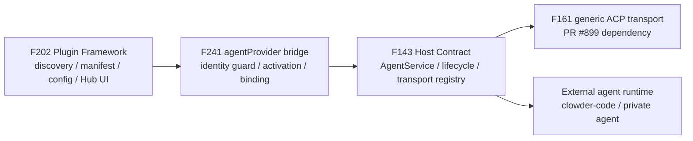

# F241: Agent Provider Plugin / Hostable Provider Runtime

> **Status**: accepted feature anchor | **Owner**: Community (彭潇 / `bouillipx`) + Cat Cafe maintainer guard | **Priority**: P1
> **Source**: operator request 2026-06-18 — "我有自己的 agent 需要接入进来"; community architecture discussion [clowder-ai#941](https://github.com/zts212653/clowder-ai/issues/941); maintainer decision [#941 comment 4739146327](https://github.com/zts212653/clowder-ai/issues/941#issuecomment-4739146327).
> **Decision**: accepted as **F241: Agent Provider Plugin / Hostable Provider Runtime**. This is a new provider-extension feature anchor, **not** "F202 Phase 3" by default, and **not** a rename of F143. It is the F143 host-contract lineage plus the F202 plugin discovery/config surface, composed into a provider-as-plugin product capability.

Architecture cell: `provider-extension` (new) — sits above F143 `hostable-runtime` and F202 `plugin`, composing both.

Map delta: added — `provider-extension` owns how an externally declared agent provider becomes a routeable, @-mentionable cat without editing the hardcoded `ClientId` union or the `packages/api/src/index.ts` provider switch. It consumes host-owned transports from F143/F161 and extends F202 with an `agentProvider` manifest resource.

## Why

Cat Cafe can already host several built-in agent providers, but adding a new external agent runtime still requires core edits:

1. edit `packages/shared/src/types/cat.ts` to add a `ClientId`;
2. edit `packages/api/src/index.ts` provider construction;
3. add bespoke provider service / event transform code;
4. update Hub provider UI;
5. merge a core PR for every new runtime.

That is not a plugin path. It blocks the operator's immediate requirement: a private/custom agent runtime should be connectable to Cat Cafe without vendoring it into this repository and without making every provider a one-off core patch.

The target shape is:

- Cat Cafe owns the northbound contract, routing, identity, callback/MCP injection, cwd/sandbox, audit, cancel, timeout, and UI/config boundary.
- External agent runtimes are installed and managed outside Cat Cafe core.
- A plugin/provider package declares metadata and a constrained transport binding.
- Cat Cafe activates that declaration into a routeable cat only through host-owned transport implementations.

## Current source anchors

| Fact | Anchor | Consequence |
|---|---|---|
| Provider identity is still a fixed `ClientId` union | `packages/shared/src/types/cat.ts` | New provider identity still implies core type churn. |
| Provider construction still lives in API startup wiring | `packages/api/src/index.ts` | New provider transport still tends to become a core branch. |
| F202 owns plugin discovery/config/resource activation | `docs/features/F202-plugin-framework.md` | `agentProvider` belongs as a new resource family, not as an ad hoc config file. |
| F143 owns the hostable runtime contract concept | `docs/features/F143-hostable-agent-runtime.md` | F241 must consume/advance this host contract, not fork a parallel registry. |
| F161 / PR #899 generalizes ACP | `docs/features/F161-acp-carrier-generalization.md`, PR #899 | F241 should consume generic ACP once merged; do not rebuild it. |
| F240 / PR #903 validates manifest/config/Hub patterns | PR #903 | F241 can reuse the manifest/config/UI precedent after merge, but routeable agents are a higher trust tier than IM connectors. |
| F211 runtime-session enum is still narrow | `docs/features/F211-cross-runtime-session-transparency.md` | New provider runtimes need session/audit visibility, not hidden sidecars. |

## Ownership boundary

F241 owns the bridge between plugin declaration and routeable agent identity:



| Layer | Owns | F241 must not re-own |
|---|---|---|
| F202 | plugin discovery, manifest parsing, config store, Hub rendering, resource activation mechanics | host transport semantics |
| F143 | hostable runtime contract, lifecycle, host-owned transport registry | plugin discovery / manifest ecosystem |
| F161 | generic ACP carrier implementation and env/session/pool details | provider-as-plugin identity and activation |
| F240 | manifest/config-store/Hub UI precedent for IM connectors | routeable agent trust boundary |
| F241 | `agentProvider` resource, provider identity governance, plugin-to-host binding, routeable cat activation | arbitrary provider code execution |

## Proposed manifest shape

Initial sketch:

```yaml
id: clowder-code
resources:
  - type: agentProvider
    providerId: clowder-code
    displayName: Clowder Code
    transport: acp
    command: clowder-code
    startupArgs: ["--acp"]
    accountRef: optional-account-binding
    eventProfile: cat-cafe-agent-message-v1
    mcpWhitelist:
      - cat-cafe-collab
      - cat-cafe-memory
    sandbox: workspace-write
    healthCheck:
      type: acpInitialize
```

Important constraints:

- `transport` must reference a host-owned allowlisted transport.
- `command` is an already-installed command in Phase A; no plugin installer scripts.
- callback/MCP credentials are injected only by host code.
- provider identity must pass namespace and routeability checks before becoming a cat.

## Accepted Phase Split

### Phase A — Host Transport Intake Slice

Goal: prove one host-owned transport path and one external runtime end to end without adding a new bespoke provider branch.

Inputs:

- F161 / PR #899 if merged: consume the generic ACP carrier instead of rebuilding Gemini ACP generalization.
- If ACP is not ready for the operator's private agent, allow a constrained A2A or CLI JSONL smoke path to validate identity/routing/audit first.

Acceptance criteria:

- One host-owned transport path is registered and selected by data/config.
- One external runtime can be invoked as an already-installed command or service.
- Streaming output maps to `AgentMessage` / thread-visible events.
- cancel, timeout, startup failure, and no-event failure paths are visible.
- cwd/workspace/sandbox policy is host-controlled.
- callback/MCP injection is host-owned and test-covered.
- session-chain/audit metadata is written for the external runtime.

### Phase B — F202 `agentProvider` Resource

Goal: make provider activation declarative through the plugin framework.

Acceptance criteria:

- F202 manifest schema accepts `agentProvider` with strict validation.
- Invalid transports, duplicate provider IDs, builtin namespace collisions, and forbidden capability claims are rejected.
- Hub can render provider config from manifest/config-field metadata without provider-specific UI.
- Config values resolve through a host-owned config store; plugin code does not receive secrets directly.
- Health checks are host-owned and declared/configured, not arbitrary script execution.

### Phase C — Reference Runtime

Goal: use `clowder-code` as the reference runtime for proving the extension point without vendoring it into Cat Cafe core.

Acceptance criteria:

- A routeable cat invokes the external runtime from a normal thread.
- The runtime can stream a reply back into the thread.
- session chain, audit, cancel, timeout, and failure states are inspectable.
- A2A handoff and @ mention routing cannot target the provider until identity governance has approved it.
- E2E proof includes at least one denied capability / denied namespace case.

## Identity and Routeability Governance

This is not just a sandbox problem. A provider plugin can create a routeable participant in the collaboration system.

Required controls:

- provider IDs live in a reserved namespace, separate from built-in `ClientId`s unless explicitly migrated;
- plugins cannot claim `anthropic`, `openai`, `google`, `kimi`, `opencode`, `catagent`, `a2a`, or any existing runtime cat ID;
- routeable `catId` and `@alias` activation requires explicit host approval;
- provider identity, plugin source, transport, command, and capability grants are audit-visible;
- a provider cannot become an A2A target until activation and health checks pass.

## Safety Boundaries

These are acceptance boundaries, not implementation details:

- no arbitrary same-power JS factory;
- no plugin-provided `install.sh` / `uninstall.sh` in Phase A;
- no plugin code directly receives callback tokens, session tokens, JWTs, or MCP credentials;
- no plugin activation writes runtime config such as `~/.clowder-code/config.json`;
- no external archive install/update/uninstall until signing, trust, network, and explicit user confirmation policy exists;
- later installer support, if accepted, must use host-owned allowlisted strategies such as `npm`, `github-release`, `homebrew`, or `manual`.

## Dependencies and Precedents

- **F143**: canonical hostable runtime contract lineage. F241 should advance or consume this, not fork it.
- **F161 / PR #899**: generic ACP transport. If merged first, F241 Phase A should consume it.
- **F202**: plugin discovery/config/activation and future `agentProvider` manifest resource.
- **F240 / PR #903**: manifest/config-store/Hub UI and host-owned plugin lifecycle precedent for IM connectors. Useful but lower trust than routeable agent providers.
- **F211**: runtime session visibility and audit surfaces must include external agent runtimes.
- **F129**: no same-power plugin execution.

## Non-goals for the First Slice

- Do not vendor the private agent or `clowder-code` into Cat Cafe core.
- Do not convert every existing built-in provider to plugin registration in the first PR.
- Do not solve external runtime installation in Phase A.
- Do not treat F240 IM connectors as equivalent trust tier to routeable agent providers.
- Do not add a second, private transport registry under F241.

## Design Gate Items

These are no longer blockers for feature-anchor acceptance, but must be settled before or during the first implementation slice:

1. Whether Phase A requires ACP immediately or allows A2A / CLI JSONL as the first smoke path while ACP support lands.
2. Exact `agentProvider` manifest shape after the host-owned registry contract exists.
3. How much Hub UI belongs in Phase B versus the reference-runtime proof.
4. Final F143 / F161 / F202 boundary alignment for transport registry ownership and manifest activation.

## Implementation Notes

- Phase A first slice extracts host-owned provider transport selection into `ProviderTransportRegistry`.
- ACP is the first registered host transport via `AcpProviderTransportFactory`, consuming the F161 `AcpServiceFactory`.
- Transport selection remains before the legacy `clientId` provider switch. A declared transport that fails validation is terminal and must not fall back to a provider-specific branch.
- Phase A second slice adds raw catalog `providerTransport` intake for host-owned transport selection. This is a temporary activation surface, not the Phase B F202 manifest resource.
- `cli-jsonl` is the first constrained smoke transport for `clowder-code`-style runtimes while ACP/A2A support lands in the external runtime. Prompt delivery is stdin-only; command, cwd, env injection, timeout, and JSONL mapping remain host-owned.
- Raw `providerTransport` is rejected for builtin client identities and existing routeable cat IDs; the temporary raw surface cannot replace `codex`, `opus`, or other trusted builtin participants.
- `cli-jsonl` defaults to resumable session behavior when the reference runtime can receive the prompt without lossy encoding. Fresh turns use `startupArgs`; follow-up turns with a host `sessionId` use `resumeArgs` with a required `{sessionId}` placeholder only for raw single-line prompts. If the effective prompt contains real line breaks, the host emits `session_continuity_degraded`, seals the old active SessionRecord, runs a fresh one-shot invocation with the original prompt payload, and binds any fresh `session_init` to a new SessionRecord. A transport that is intentionally stateless must declare `sessionPolicy: "stateless"`.
- `cli-jsonl` participates in host raw-event archive diagnostics by passing `rawArchivePath` into `spawnCli` and appending sanitized JSONL events by invocation ID.
- Phase B identity-governance foundation derives reserved routeable IDs from a host-owned base `cat-template.json` builtin baseline plus active non-`providerTransport` profiles. Raw `providerTransport` activation fails closed when that baseline cannot be read, so catalog/plugin input cannot self-remove a trusted cat ID from the reserved set.
- F202 `agentProvider` manifest parsing/activation is intentionally not part of this first slice.

Temporary raw catalog shape for Phase A smoke activation:

```json
{
  "clientId": "clowder-code",
  "providerTransport": {
    "transport": "cli-jsonl",
    "command": "clowder-code",
    "startupArgs": ["--json", "--non-interactive"],
    "resumeArgs": ["resume", "{sessionId}", "--json"],
    "sessionPolicy": "resume",
    "outputProfile": "clowder-code-turn-result-v1"
  }
}
```

## Phase B Slice 2b Design Notes — Routeable Gate

Settled 2026-06-22 via pre-worktree design gate (opus driving; codex + gpt52 independent review). 2a (`b4a87e3c`) shipped a non-routeable `transportReady` capability. Slice 2b promotes "declared" → "routeable" via a 6-step gate, with **explicit owner approval as the only path** from `routeable: false` to `routeable: true`.

### 6-step routeable gate

| # | Step | Owner | 2a delivered | 2b delta |
|---|---|---|---|---|
| 1 | manifest valid | `parseAgentProvider*` | ✅ | — |
| 2 | host transport exists | `providerTransportRegistry.has(...)` | ✅ | — |
| 3 | reserved + collision admission | `RoutingAdmissionService` (new) | — | new service |
| 4 | explicit owner approval | host-owned `routeableApproved` field | — | new field + admin surface |
| 5 | host health pass | `acpInitialize` / `cliProbe`, descriptor-bound | — | new, bound to descriptor hash |
| 6 | AgentRegistry service registered | existing `syncAgentRegistry → createServiceForConfig` | — | enqueue to existing serialized sync coordinator |

### Three-field state model

Replaces 2a's two-field literal-`false` shape. The shared contract widens from literals to booleans (`packages/shared/src/types/capability.ts:49`) — without this, all subsequent state transitions lie via type casts.

| Field | Semantics | Mutation source |
|---|---|---|
| `routeableApproved` | **owner intent** — operator affirmatively granted approval | host action only (admin surface). Reset to `false` automatically when descriptor hash changes. Never written by `activateAgentProvider`. |
| `health` | **last health-check result** — `{ result, timestamp, ttlMs, descriptorHash }` | host runs declared `healthCheck` on approval (sync, blocking). Invalidated when descriptor hash changes. Refreshed synchronously on startup/sync when TTL expired. |
| `routeable` | **effective truth** — "you can `@` this cat now" | computed: `admission.passed && routeableApproved && health.fresh && registry.synced`. Never written directly by the activator or manifest. |

### RoutingAdmissionService

Single source of truth for "is this candidate eligible to become routeable":

- **Inputs**: candidate descriptor + binding + snapshot of (template baseline, all routeable providers/builtins/active cats).
- **Output**: `{ admitted: boolean, reason?: string }`.
- **Callers**: owner approval path (early failure) **and** `syncAgentRegistry` projection (re-validate before injecting any synthetic cat-config).
- **Red line**: NEVER inject the candidate into runtime config/map before admission passes. Reserved snapshot is computed with the candidate explicitly excluded — mirrors Slice 1's pattern in `ProviderTransportRegistry`. Skipping this re-introduces parsing-order self-exemption, the exact hole Slice 1 closed.

Collision check is broader than reserved namespace: candidate `providerId / profileId / catId / mentionPatterns` must not collide with **any** existing routeable provider/builtin/active cat.

### Descriptor hash (canonical, persisted in capability row)

Computed on every upsert in `activateAgentProvider`. If changed → reset `routeableApproved = false` and invalidate health. Owner must re-approve.

Hash inputs:
- `pluginId`, `capId` / resource name
- `transport`, `command`, `startupArgs`, `resumeArgs`
- `sessionPolicy`, `outputProfile`, `timeoutMs`
- `mcpWhitelistRequest`, `sandboxRequest`
- `healthCheck` (full object)
- routeable identity claims: `providerId`, `profileId`, `catId`, `mentionPatterns`
- plugin/package fingerprint (if available; tracked as residual risk if not — see Non-goals)

### Routeable identity ownership

Plugin manifest declares `providerId / displayName / mentionPatterns` as **claims**; host owns the actual binding record (`catId / @alias`) decoupled from manifest. Route resolver reads ONLY the host-owned binding — never the manifest resource directly. All routeable identity claims feed the descriptor hash, so any change forces re-approval.

### Health timing

- **On approval**: synchronous, blocking. Run declared `healthCheck`. Success → atomic write `routeableApproved=true + health.fresh + routeable=true`. Failure → `routeable=false`, log error, preserve previous state.
- **On startup / sync** of already-approved capability with expired TTL: synchronous refresh. Failure → `routeable=false`, log error.
- **Background flip `false → true`**: **NEVER**. Routeability is granted only through explicit operator approval; subsequent checks can DEGRADE but not GRANT.
- **No declared `healthCheck`** on a candidate that wants `routeable`: fail-closed admission. No default probe substitute.

### Background actor permission split

Settled via codex + gpt52 Q3 convergence round (2026-06-23). Shared invariant: **`routeable=true` may only be produced by an auditable explicit admission/sync chain — `approval + descriptor-hash-bound fresh health + reserved/admission pass + AgentRegistry projection`**. Health worker provides evidence; it is never the routing authority.

| Actor | May do | Must NOT do |
|---|---|---|
| Background health worker | Refresh `health.checkedAt / passed / failureReason` as telemetry. Degrade `routeable: true → false` when a refresh fails. Enqueue a sync request to the serialized coordinator (which then runs through the explicit projection path). | Directly write `routeable: false → true`, even when `routeableApproved=true` and a fresh health re-check passes. |
| Explicit synchronous paths (approval, startup, `syncAgentRegistry` projection, `plugin enable`) | Exclusively own the `routeable: false → true` promotion, atomically with admission + fresh health. | Skip admission, skip the descriptor-hash binding on health, or rely on background-supplied `routeable: true` without re-checking the full chain. |

This split is the security/audit boundary, not a runtime convenience knob: it ensures that whenever an operator observes `routeable=true`, there is a traceable host transaction (with the descriptor-bound health result) responsible for it. Silent self-healing from a degraded state is forbidden by design.

### Sync trigger + serialization

- Post-write enqueues to the **existing serialized sync coordinator** that already handles plugin enable/approve, cat-config change, and account change. No naked parallel sync, no separate watcher.
- Idempotency key: `(pluginId, capId, descriptorHash, bindingHash)`.
- Sync re-reads latest persisted capability/binding snapshot before projection — concurrent cat-config edits cannot strand the AgentRegistry on a stale snapshot.
- Failure → no partial AgentRegistry state. Rollback effective `routeable=false`, record `lastSyncError`. Preserve `routeableApproved=true` and `health` if `descriptorHash` unchanged — retry doesn't need re-approval.

### Failure recovery summary

| Failure point | `routeable` | `routeableApproved` | `health` |
|---|---|---|---|
| Step 3 admission fail | stays `false` | unchanged | unchanged |
| Step 4 (no approval) | stays `false` | unchanged | unchanged |
| Step 5 health fail (approval-time) | stays `false` | stays `false` (atomic) | written as failed |
| Step 5 health fail (TTL refresh) | flipped `false` | unchanged | refreshed to failed |
| Step 6 sync fail | flipped `false`, `lastSyncError` recorded | unchanged | unchanged |
| Descriptor hash change (manifest mutation) | flipped `false` | reset `false` | invalidated |

### Non-goals for 2b

- No auto-promotion of `mcpWhitelistRequest` / `sandboxRequest` into runtime grants — those stay request semantics; host grant flows through F202 capability policy, not manifest auto-promotion.
- No multi-process or distributed sync coordination — the existing in-process serialized coordinator is sufficient for Phase B.
- No Hub UI for owner approval — Phase B exposes the admin surface as a host-internal route + CLI; Hub admin UI is Phase C scope.

### Residual risk (tracked, not blocking 2b)

Plugin/package fingerprint: if a fingerprint is available (npm tarball hash, git SHA), it enters the descriptor hash and any plugin-body change forces re-approval. If only a directory path is available, the manifest can stay identical while the plugin body mutates silently. Tracked as F241 follow-on hardening, not a 2b blocker.

## Timeline

- 2026-06-16: #941 opened for plugin-owned `agentProvider` resource / external agent runtime provider path.
- 2026-06-17: #941 discussion converged on provider-extension feature framing, architecture diagram, F161/#899 and F240/#903 dependency roles.
- 2026-06-18: operator approved starting the feature locally because a private agent needs to be integrated.
- 2026-06-18: maintainer decision accepted #941 as F241, with `clowder-code` as the reference runtime, Phase A/B/C rollout, and safety boundaries promoted to acceptance criteria.
- 2026-06-18: Phase A first implementation slice started with host-owned `ProviderTransportRegistry` and ACP transport factory extraction.
- 2026-06-18: Phase A second implementation slice started with raw `providerTransport` selection and `cli-jsonl` reference-runtime smoke transport.
- 2026-06-22: Phase B identity-governance foundation started to replace static routeable denylist drift with template-baseline plus active-catalog reserved identity derivation.
- 2026-06-22: Phase B Slice 2a shipped `b4a87e3c` — `agentProvider` manifest descriptor, non-routeable / `transportReady` state, fail-closed transport activation.
- 2026-06-22: Phase B Slice 2b design gate passed — 6-step routeable gate, three-field state model, `RoutingAdmissionService` + descriptor-hash invalidation + serialized sync coordinator (opus driving; codex + gpt52 design review).
- 2026-06-23: Phase B Slice 2b Q3 TTL convergence round (codex + gpt52) — both converged on `S1 No / S2 No / S3 Yes`; locked shared invariant that `routeable: false → true` is the exclusive domain of explicit synchronous paths. Background actors may refresh telemetry and degrade, never promote. Design notes amended.
- 2026-06-23: Phase B Slice 2b end-to-end shipped on `feat/F241-phase-b-slice2b-routeable-gate` — shared types widening, `RoutingAdmissionService`, descriptor-hash + activator integration, approval orchestration + HTTP route, post-approval sync hook, routeable binding + projection, end-to-end integration test. Health executor ships as transport-availability probe; real `acpInitialize` (runtime initialize handshake) and `cliProbe` (bounded spawn + exit-code check) probes are tracked as **Slice 2c follow-on hardening** — the executor is a drop-in DI swap (`AgentProviderHealthExecutor` interface in `agent-provider-health-executor.ts`), no further redesign needed.
